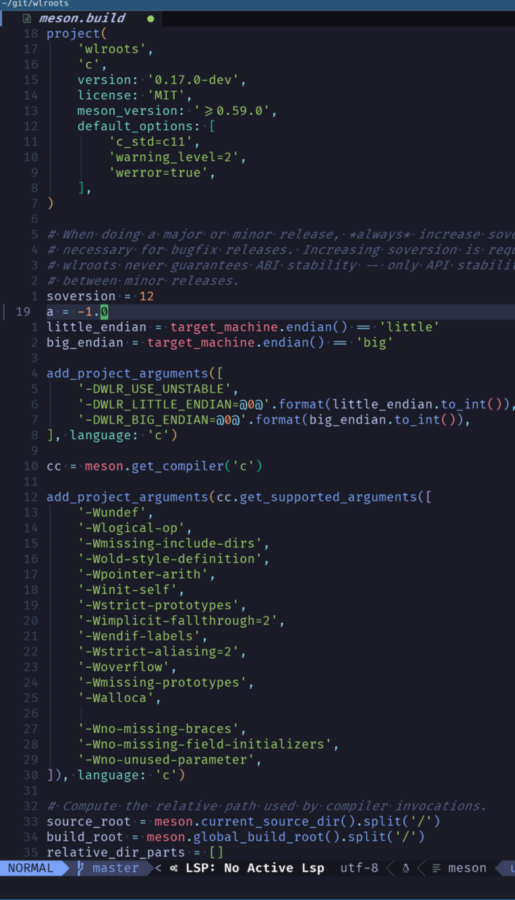

# tree-sitter-meson

Treesitter for meson build

It just works, for highlight in neovim

### Known bug

if comment in some where, the Treesitter will break

## Files

### base.js

about the base types and command

### closure.js

if else and loop

### operation.js

operate

## FIXME

Better handle of comment, maybe need scanner.c, but I am not good at c

## Help

I need more tests

please give the issues, I will try to fix

## TODO

Take it as a reference and make a new one

https://github.com/dcbaker/meson-plus-plus/blob/main/src/frontend/parser.yy

I don't think it can be used to make lsp or format.. It is bad
